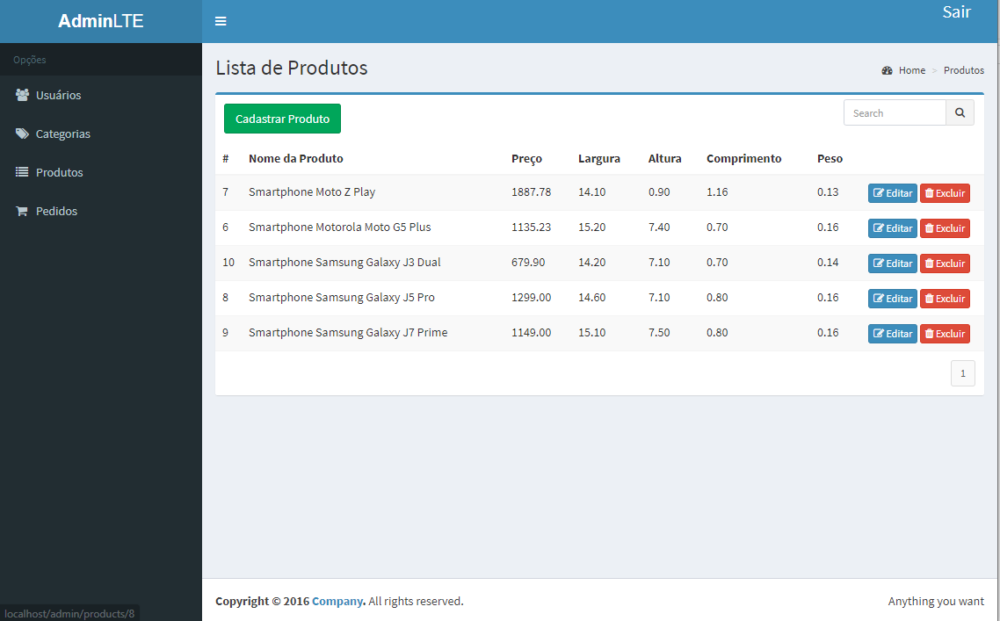
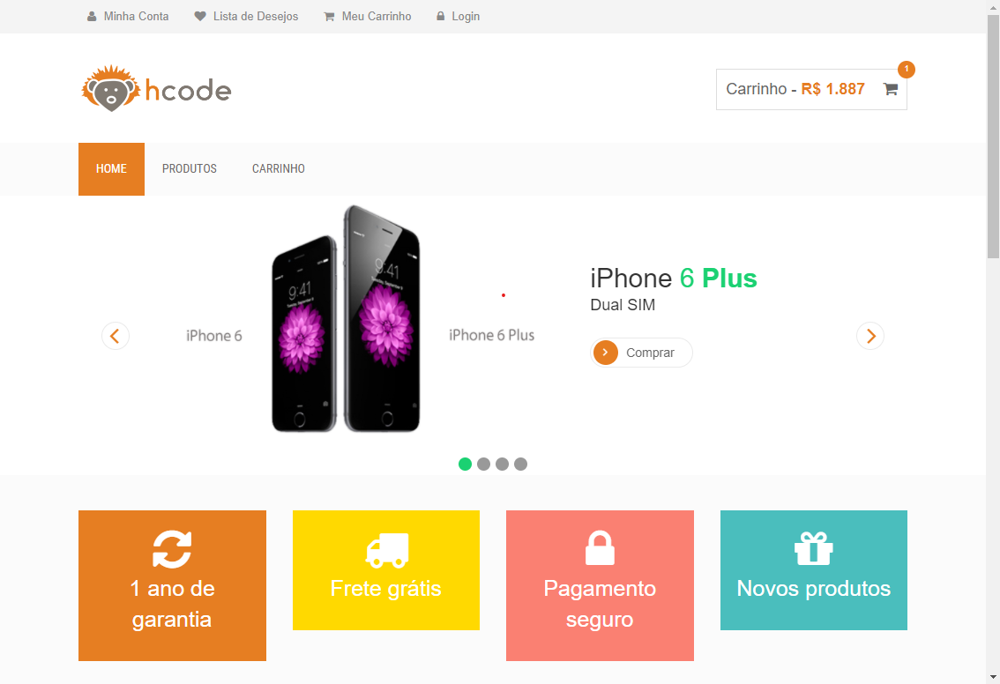
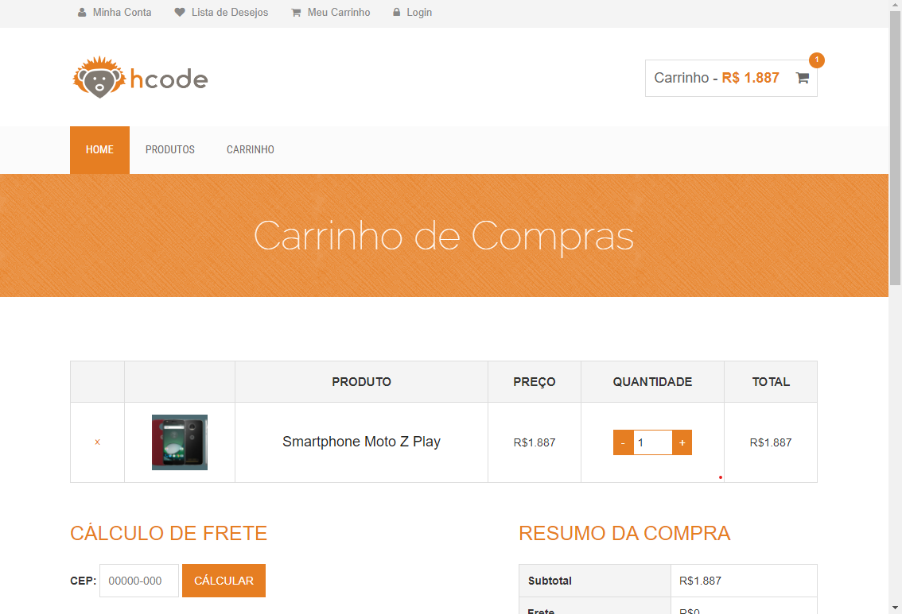
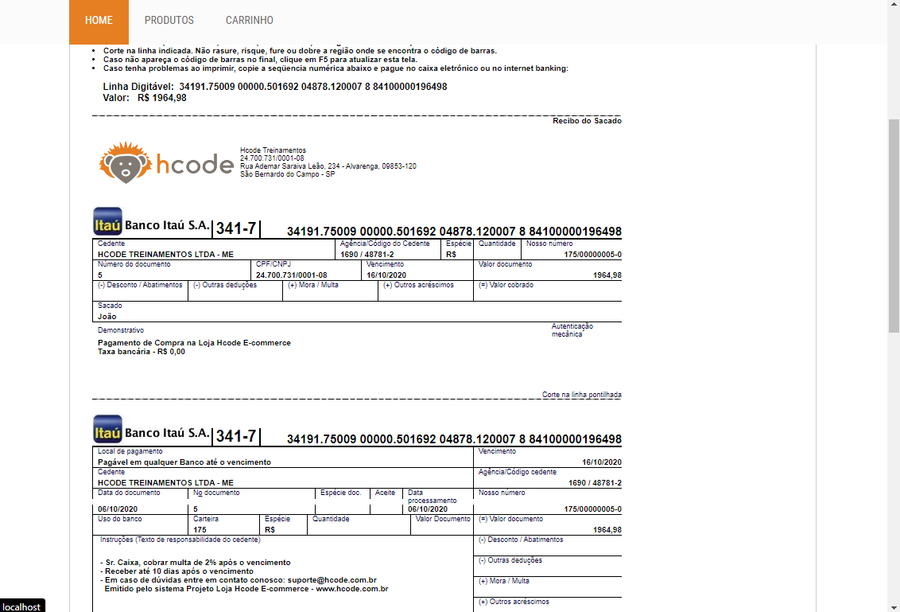
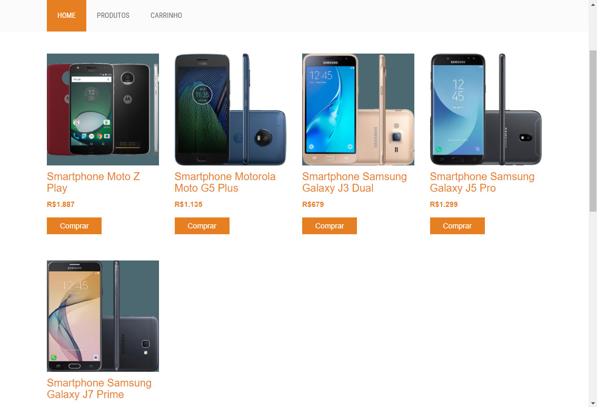

# Projeto e-commerce 
## Descrição 📋
Projeto de um e-commerce de dispositivos móveis criado durante as aulas do curso 'Curso de PHP 7' com o objetivo de aplicar os conhecimentos obtidos em PHP, SLIM, RainTPL, PDO e outros assuntos abordados.
## Objetivo do projeto 🏃
Entender como a criação de um site com PHP funciona na prática.
## Status ❗
:white_check_mark: Concluído
## Tecnologias Usadas
 :heavy_check_mark: PHP7
 
 :heavy_check_mark: MySQL
 ## Features ➕
  - [x] Login, cadastro e alteração de senhas de usuários
  - [x] Carrinho de compras
  - [x] Cálculo de frete através da API dos correios
  - [x] Cadastro de produtos e categorias (marcas)
  - [x] Gerador de boletos com boletoPHP
  - [x] Recuperação de senhas
  - [x] Módulo de administrador onde é possível ver e alterar usuários, pedidos, produtos e categorias
  
  ## Como usar :bookmark_tabs:
  ### Requisitos para instalação
  :heavy_check_mark: PHP7 instalado globalmente [tutorial](https://webdevbr.com.br/fazendo-o-php-funcionar-no-console-cmd-do-windows-instalando-o-composer-e-o-git)
     
  :heavy_check_mark: Uma instância de MySql
  ### Usando o projeto 
  1. Baixe o projeto
  2. Abra a pasta do projeto com um programa de linha de comando (cmd)
  3. Digite php -S localhost:8000 para iniciar o servidor embutido do PHP
  4. No navegador vá até o endereço http://localhost:8000
  5. Execute o script mysql no arquivo db_ecommerce-dump.sql
  6. Para entrar no modo administrador vá até o endereço  http://localhost:8000/admin e digite o login admin e a senha 1234
  7. Para usar o 'esqueci minha senha' vá em vendor/hcodebr/php-classes/src, abra o arquivo Mailer.php e adicione um e-mail do gmail a constante USERNAME e a senha do e-mail na constante PASSWORD

## Screenshots :camera:
### Módulo Admin

### Módulo usuário

### Carrinho de compras

### Boleto

### Produtos

## Informações adicionais
Projeto desenvolvido do zero no [Curso de PHP 7](https://www.udemy.com/curso-completo-de-php-7/) disponível na plataforma da Udemy e no site do [HTML5dev.com.br](https://www.html5dev.com.br/curso/curso-completo-de-php-7).

Template usado no projeto [Almsaeed Studio](https://almsaeedstudio.com)
